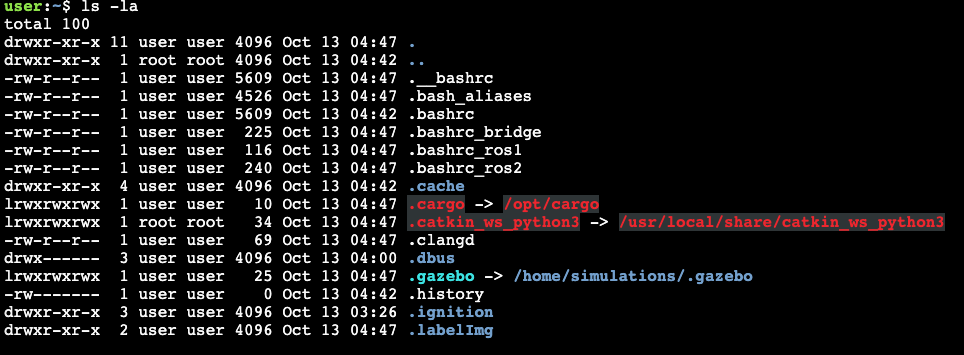

# ROS를 위한 linux

## 경로 찾기

```bash
cd /home/user/catkin_ws/src/linux_course_files/move_bb8_pkg/src/
```

/home/user/ 는 일반적으로 사용자의 **HOME** 폴더이다. **HOME**폴더는 **~** 로 축약할 수 있다.

```bash
cd ~/catkin_ws/src/linux_course_files/move_bb8_pkg/src/
```


## ls 명령어는 숨겨진 파일을 시각화 하지 못한다.

```bash
ls -la
```



> '.'의 의미는 숨겨져 있다는 의미이다.

