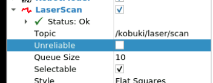

# ROS

## 진행
- 몇가지 기본 개념 배우기
- 토픽에 대해 배우기
ROS는 거의 모든 커뮤니케이션을 토픽을 통해 처리한다.

### 간단한 실행

**terminal #1**

```bash
> roslaunch publisher_example move.launch
```

위 명령을 통해 코부기 로봇을 움직일 수 있음
<br />


아래 명령을 통해 코부기 로봇을 정지할 수 있음

**terminal #1**

```bash
> roslaunch publisher_example stop.launch
```

위 명령어를 통해 코부기 로봇을 정지할 수 있음

### 무엇이 일어났는 가?
메세지를 토픽에 쓰는 ROS프로그램인 게시자를 실행한 것이다. 이 토픽은 로봇의 베이스에 속도 명령을 보내는 데 사용되는 토픽이다.

>토픽을 통해 메세지를 보내면 로봇이 움직이기 시작한다.

- 서비스에 대해 알아야 함
   - 서비스를 사용하면 로봇의 특정 기능을 코딩한 다음 누구나 로봇을 호출할 수 있도록 할 수 있다.

### 서비스 예제

서비스를 호출하는 모든 사람이 사용할 수 있도록 서비스를 시작한 뒤 해당 서비스를 호출하는 명령으로 로봇을 움직인다.

**terminal #1**
```bash
roslaunch service_demo service_launch.launch
```

**terminal #2**
``` bash
rosservice call /service_demo "{}"
```


> 서비스를 호출하기 전에 서비스가 먼저 실행 되어야한다.

- 액션에 대해 알아야 한다.

서비스와 액션은 유사하지만 서비스는 호출 시 서비스가 종료되기 전까지 다른 작업을 수행하지 못한다. 하지만 액션을 호출하면 해당 액션을 수행하는 동안 다른 작업을 계속할 수 있다.

### 액션 예제

**termianl #1**

```bash
> roslaunch action_demo action_launch.launch
```

위 명령어는 액션을 실행하는 명령어 이다.

아래 명령어는 액션을 호출하는 명령어이다.

```bash
> roslaunch action_demo_client client_launch.launch
```

- 디버깅 도구 사용법을 알아야 한다.

```bash
> rosrun rviz rviz
```


1. base_link의 고정 프레임 변경


2. add 버튼을 통해서 로봇 모델 옵션을 선택함


3. add 버튼을 통해서 LaserScan옵션을 선택함



