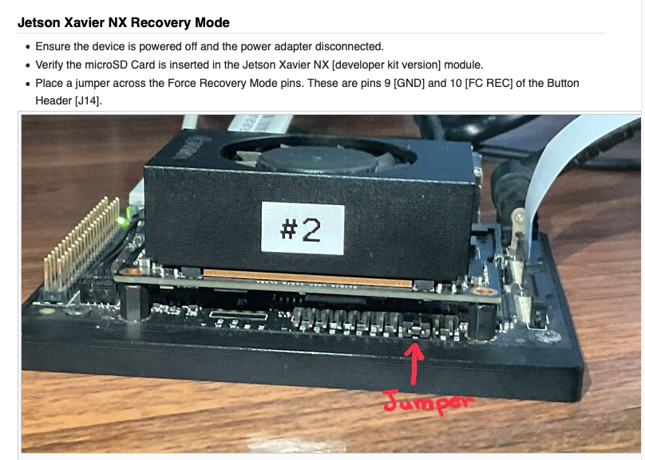
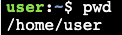
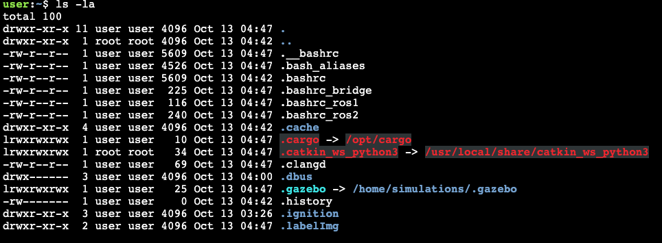

## 현재 해결하지 못한 오류
ros2가 연결이 완료되었지만 PWM신호를 만들지 못함
단순히 GPIO 포트에서 High 하거나 Low하는 신호는 정상적으로 됨
jetson-io에서 configuration 수정을 하면 된다고 하지만 jetson-io가 켜지지 않고
바로 꺼지는 오류가 발생함

- 이를 해결하기 위해 커뮤니티를 탐색하여 해결방법들을 적용해봤지만 해결되지 않음

- 현재 최종적인 해결법은 NVIDIA SDK Manager를 사용하여 Jetpack 및 관련 소프트웨어 설치 Jetson
   초기화 방법이다.

관련사진은 다음과 같다



# docker로 ros2실행 gpt정리
좋아, 이제 완벽하게 Docker로 ROS2를 실행하고, VSCode에서 환경변수까지 한 방에 설정하는 법을 깔끔하게 정리해줄게! 🔧

🧩 최종 정리: Docker에서 ROS2 + VSCode 완벽 설정법

🚀 Step 1: Docker에서 ROS2 컨테이너 실행

터미널에서 아래 명령어로 ROS2 컨테이너를 실행해.

docker run -it --rm --network host --name ros2-container osrf/ros:humble-desktop bash

✅ 명령어 설명:
	•	-it → 인터랙티브 모드로 컨테이너 실행.
	•	--rm → 컨테이너 종료 시 자동 삭제.
	•	--network host → 네트워크 설정이 필요할 때 사용 (특히 ROS2의 DDS 통신용).
	•	--name ros2-container → 컨테이너 이름 지정.
	•	osrf/ros:humble-desktop → ROS2 Humble Desktop 이미지.

🔧 Step 2: VSCode에서 컨테이너 접속

1️⃣ VSCode 열고,
2️⃣ Command Palette (Cmd + Shift + P) 실행.
3️⃣ “Remote-Containers: Attach to Running Container” 선택.
4️⃣ 방금 실행한 ros2-container 선택.

⚙️ Step 3: 환경 변수 자동 설정

컨테이너 안에 들어갔으면, 다음 파일을 수정해서 ROS2 환경 변수를 영구적으로 설정해 줘.

1️⃣ ~/.bashrc 파일 열기:

nano ~/.bashrc

2️⃣ 아래 내용 추가:

source /opt/ros/humble/setup.bash

3️⃣ 저장하고 나가기 (Ctrl + O, Enter, Ctrl + X)

📂 Step 4: 터미널 재시작

환경 변수 적용을 위해 터미널을 다시 열어주고:

source ~/.bashrc

🤖 Step 5: Talker/Listener 실행하기

이제 터미널 두 개를 열어서 각각 Talker와 Listener를 실행해봐.

터미널 1:

ros2 run demo_nodes_cpp talker

터미널 2:

ros2 run demo_nodes_cpp listener

🎯 최종 결과 확인

이제 너처럼 VSCode 터미널을 두 개 열어서 Talker와 Listener가 통신하는 걸 볼 수 있을 거야! 🚀

💡 만약 추가 컨테이너를 실행하고 싶다면?

컨테이너를 새로 실행할 때마다 환경변수를 수동으로 설정하지 않으려면, 아예 도커 이미지에 환경 변수 설정을 포함한 새로운 이미지를 만들 수도 있어.

더 궁금한 거 있으면 언제든지 물어봐! 😎
지금 페이스 아주 좋아~ 계속 가자! 💪

# mac os에서 원격 접속 방법
1. jetson xavier 에서 ifconfig로 ip확인
2. 확인된 ip를 이용하여 연결
```bash
username@ip
```
3. vscode에서 ssh연결시 동일한 방법(단 board가 로그오프되면 연결이 종료됨)


# ros 기본 명령어 모음 

## ros2 버전확인 방법

```bash
ros2 doctor
```

- 예상 출력

```bash
kim@kim-desktop:~$ ros2 doctor
/opt/ros/foxy/lib/python3.8/site-packages/ros2doctor/api/platform.py: 82: UserWarning: Distribution foxy is no longer supported or deprecated. To get the latest features, download the new versions at https://index.ros.org/doc/ros2/Installation/

All 4 checks passed
```

## 간단한 설치 확인 방법 혹은 테스트

터미널 2개를 열어서 확인할 수 있음

```bash
ros2 run demo_nodes_cpp talker
``

```bash
ros2 run demo_nodes_cpp listener
```


# ROS를 위한 linux

## 경로 찾기

```bash
cd /home/user/catkin_ws/src/linux_course_files/move_bb8_pkg/src/
```

/home/user/ 는 일반적으로 사용자의 **HOME** 폴더이다. **HOME**폴더는 **~** 로 축약할 수 있다.

```bash
cd ~/catkin_ws/src/linux_course_files/move_bb8_pkg/src/
```



## ls 명령어는 숨겨진 파일을 시각화 하지 못한다.

```bash
ls -la
```



> '.'의 의미는 숨겨져 있다는 의미이다.


# shortcuts
## start terminal

> window + T

## show applications

> window + A

